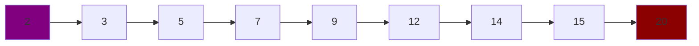
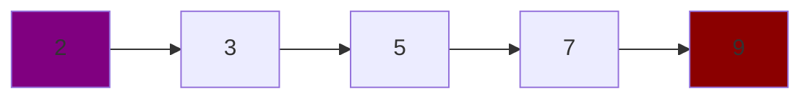
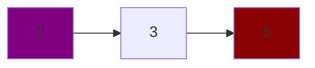

# Binary Search

Binary search is a divide and conquer algorithm, it is used in the Go standard library for searching for a value in an array:

https://go.dev/src/sort/search.go

It works by splitting the array in half, and checking if the value it picks out is higher or lower than the target value.

As an example, say we want to find the value `3` in the array `2, 3, 5, 7, 9, 12, 14, 15, 20` . The following diagram illustrates this, with the upper bound of values (the last object in the array) marked in red, and the lower bound of the array (the first value in the array) marked in purple.

Initially we check the value in the middle of the array (the length of the array halved - this is our _pivot_) - in this case that's the object in position 4 which has the value `9`.

Next we check if `9` is greater than our target value `3` - if it is, then we know that our value _must_ be in a position _lower_ than position 4. This means we can ignore any values higher than our current pivot, to do this - we simply set the upper bound value of our array to the current pivot value, and repeat the process.

Our array should now look like:

Repeating the process - our pivot is set to the object in position 2, which has the value of `5`. `5` is higher than our target of `3` so we can reduce our upper bound again to position 2. We should now have an array that looks like:

If we again check the middle of our array, we will find that our value is present, and return the result `1` to the consumer.

# Performance

Our example above required checking 3 values in an array of 9 values to find our target value. We could've found the value quicker by iterating through the array from the first value, since the value we were looking for was in the second position. However if the value had been in a higher position in the array then our approach above would've found the value using less operations than a linear search.

Binary search has the best worst case performance compared to any method of finding a value in a sorted array with no other knowledge or context provided.

We can expect O(log n) speed from a binary search, as the values we check will scale logarithmically with the input.

The memory complexity is O(1) as the number of allocations doesn't increase with the size of the input.