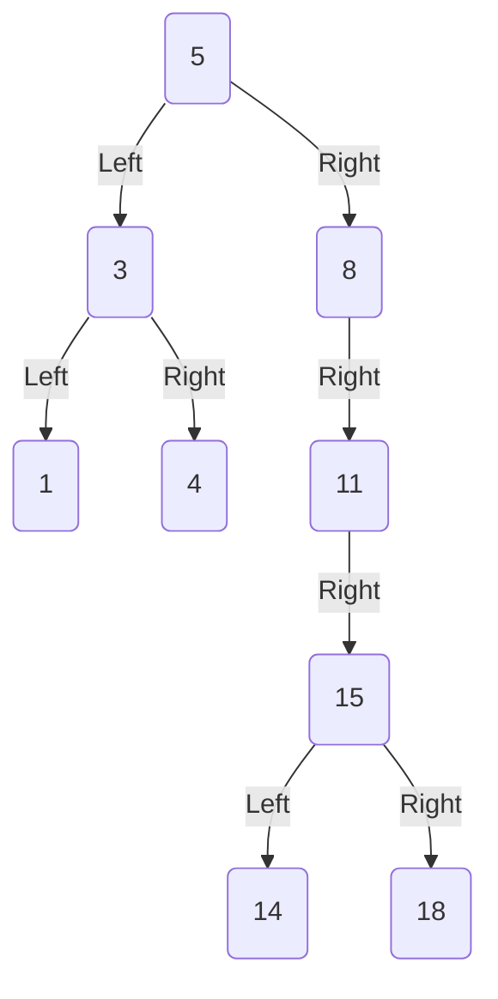

# Binary Tree

A Binary Tree is a balanced tree comprised of nodes structured like:

```go
type node struct {
    value int
    left *node
    right *node
}
```

Nodes to the left hand side of the current node are lower than the value of the current node, and nodes to the right of the current node are higher. This diagram demonstrates an example of a binary search tree:



If the tree exhibits the behaviour above, it is said to be _balanced_ - however if a binary search tree is not balanced, then it shouldn't be considered a binary search tree.